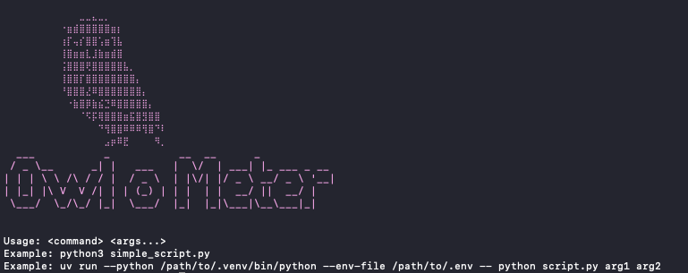

# Owl o Meter




---

A simple project written in **Rust**, designed to collect runtime metrics from a **Python process** and assist in estimating execution costs across **AWS Lambda**, **ECS Fargate**, and **EKS Fargate**.

### Collected Metrics
- Execution duration (ms)  
- Average CPU usage  
- Peak CPU usage  
- Memory usage  
- Network activity:  
  - Bytes sent  
  - Bytes received  

Although not yet tested with other programming languages, it is likely to produce similar results since the process itself is being monitored.


---

### Dev
```shell

cargo build

cargo run...

Usage: <command> <args...>
Example: python3 simple_script.py

uv:
Example: uv run --python /path/to/.venv/bin/python --env-file /path/to/.env -- python script.py arg1 arg2


cargo run -- python3 simple_script.py

```

### Release
```shell

./release-all.sh

dist/

owl-o-meter-linux
owl-o-meter-macos-arm64
owl-o-meter-macos-universal
owl-o-meter-macos-x64
owl-o-meter-windows.exe

```


### Run using the binary
```shell

✗ dist/owl-o-meter-macos-universal python3 simple_script.py

```


### Results
``` shell

** Execução concluída!

MÉTRICAS COLETADAS
━━━━━━━━━━━━━━━━━━━━━━━━━━━━━━━━━━━━━━━━
  Duração: 22033 ms
  CPU Média: 0.24%
 CPU Pico: 0.24%
 Memória Usada: 13.58 MB
 Bytes Enviados: 459423 bytes
 Bytes Recebidos: 538810 bytes

ESTIMATIVA DE CUSTOS AWS (us-east-1 (N. Virginia))
━━━━━━━━━━━━━━━━━━━━━━━━━━━━━━━━━━━━━━━━
AWS Lambda:
   • Custo por execução: $0.000046
   • Custo mensal (1M exec): $46.10

ECS Fargate:
   • Custo por execução: $0.000089
   • Custo mensal (contínuo): $10.63

EKS Fargate:
   • Custo por execução: $0.000701
   • Custo mensal (contínuo): $83.63
```


---


# AWS Services Comparison: Lambda, ECS Fargate, and EKS Fargate

## AWS Lambda

### What it is
Serverless, event-driven code execution service. You upload your code, and AWS automatically manages the entire infrastructure.

### When to use
- Short-lived scripts and functions (up to 15 minutes)
- Event-driven applications (APIs, queues, triggers)
- On-demand data processing
- Simple microservices

### Pros
- **Optimized cost**: Pay only for actual execution time (1ms granularity)
- **Zero management**: No servers, patches, or scaling to worry about
- **Automatic scalability**: From 0 to thousands of concurrent executions instantly
- **Native integration**: Easily connects with 200+ AWS services
- **Pricing model**: Ideal for intermittent or unpredictable workloads

### Cons
- **Time limit**: Maximum of 15 minutes per execution
- **Cold start**: First execution may have latency (100ms–1s)
- **Limited resources**: Up to 10GB RAM, 6 vCPUs
- **Stateless**: No state between executions
- **Vendor lock-in**: Difficult to migrate to other platforms
- **Complex debugging**: Harder to debug distributed environments

### Cost model
- **Compute**: $0.0000166667 per GB-second (us-east-1)
- **Requests**: $0.20 per 1 million requests
- **Free tier**: 1M requests + 400,000 GB-seconds/month free

---

## ECS Fargate (Elastic Container Service)

### What it is
AWS serverless container orchestration service. You define tasks (containers), and AWS provisions and manages the infrastructure automatically.

### When to use
- Containerized applications that need to run continuously
- Long-running microservices
- APIs and web services
- When you already have Docker containers

### Pros
- **Native containers**: Use any Docker image
- **Fine-grained control**: Define CPU, memory, and specific configurations
- **No time limit**: Applications can run indefinitely
- **AWS integration**: Works easily with AWS services (ALB, CloudWatch, etc.)
- **Less complex than EKS**: Easier to configure and manage
- **Flexible networking**: Full VPC and security group support

### Cons
- **Continuous cost**: Pay per hour, even when idle
- **Manual scaling**: Requires auto-scaling policies
- **Cold start**: Container startup takes 30–60 seconds
- **Less portable**: ECS is AWS proprietary
- **Orchestration overhead**: Must manage task definitions and services

### Cost model
- **vCPU**: $0.04048 per vCPU-hour (us-east-1)
- **Memory**: $0.004445 per GB-hour (us-east-1)
- **Example**: 0.25 vCPU + 0.5GB = ~$12/month (24/7 runtime)

---

## EKS Fargate (Elastic Kubernetes Service)

### What it is
Managed Kubernetes on AWS with serverless compute through Fargate. You get the power of Kubernetes without managing nodes.

### When to use
- Applications requiring Kubernetes portability
- Multi-cloud or hybrid environments
- When already using Kubernetes on-premise
- Complex microservices with advanced orchestration

### Pros
- **Full Kubernetes**: Complete K8s functionality and ecosystem
- **Portability**: Easily migrate to other providers or on-premise
- **Large community**: The biggest container ecosystem
- **Mature tooling**: Helm, Istio, Prometheus, etc.
- **Declarative**: GitOps and Infrastructure as Code
- **Multi-tenancy**: Strong workload isolation

### Cons
- **High complexity**: Steep Kubernetes learning curve
- **Cluster cost**: $73/month for the control plane alone
- **Compute cost**: Same as ECS Fargate + cluster cost
- **Operational overhead**: Must manage manifests, namespaces, RBAC
- **Over-engineering risk**: Overkill for simple apps
- **Difficult debugging**: More abstraction layers

### Cost model
- **Control Plane**: $0.10/hour (~$73/month) per cluster
- **vCPU**: $0.04048 per vCPU-hour (same as ECS)
- **Memory**: $0.004445 per GB-hour (same as ECS)
- **Example**: Cluster + 0.25 vCPU + 0.5GB = ~$85/month (24/7 runtime)

---

## Summary Comparison

| Criteria | Lambda | ECS Fargate | EKS Fargate |
|----------|--------|-------------|-------------|
| **Complexity** | ⭐ Very low | ⭐⭐ Medium | ⭐⭐⭐⭐ High |
| **Cost (intermittent workload)** | ⭐⭐⭐⭐⭐ Excellent | ⭐⭐ Expensive | ⭐ Very expensive |
| **Cost (continuous workload)** | ⭐ Very expensive | ⭐⭐⭐ Good | ⭐⭐ Moderate |
| **Portability** | ⭐ Low | ⭐⭐ Medium | ⭐⭐⭐⭐⭐ Excellent |
| **Scalability** | ⭐⭐⭐⭐⭐ Automatic | ⭐⭐⭐ Configurable | ⭐⭐⭐⭐ Advanced |
| **Control** | ⭐⭐ Limited | ⭐⭐⭐⭐ High | ⭐⭐⭐⭐⭐ Full |
| **Vendor Lock-in** | ⭐ High | ⭐⭐⭐ Medium | ⭐⭐⭐⭐⭐ Low |

---

## Recommendations

### Use **Lambda** if:
- Short executions (< 15 minutes)
- Intermittent or unpredictable traffic
- Maximum simplicity desired
- Strong integration with the AWS ecosystem  
**Do not use for:** long-running workloads or stateful applications

### Use **ECS Fargate** if:
- You already have Docker containers
- You need more control than Lambda
- Long-running applications
- Want serverless with containers  
**Do not use for:** short or sporadic workloads, or when portability is key

### Use **EKS Fargate** if:
- You need multi-cloud portability
- You already use/know Kubernetes
- Complex microservice architectures
- You have an experienced K8s team  
**Do not use for:** simple projects, MVPs, or small teams

---

## Practical Cost Example

**Scenario:** A Python script that processes data for 2 seconds using 256MB of memory

### Single execution:
- **Lambda**: $0.000001 (virtually free)
- **ECS Fargate**: $0.000028
- **EKS Fargate**: $0.000028 + cluster overhead

### 1 million executions/month:
- **Lambda**: $1.20
- **ECS Fargate**: $28 (assuming sequential execution)
- **EKS Fargate**: $28 + $73 = $101

### Running continuously 24/7:
- **Lambda**: $2,880/month (assuming 1 execution/second)
- **ECS Fargate**: $12/month (1 running task)
- **EKS Fargate**: $85/month (1 pod + cluster)